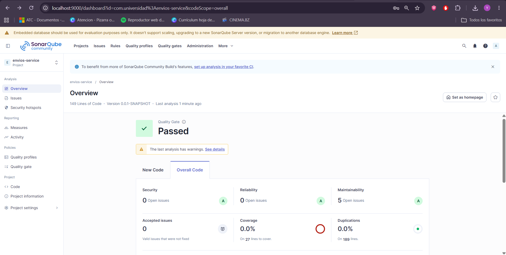

# Refactorización Avanzada y Clean Code Profundo — Post-Contenido 2

**Curso:** Patrones de Diseño de Software  
**Unidad 11:** Refactorización Avanzada y Clean Code Profundo  
**Estudiante:** Yeremy Silva  
**Materia:** Ingeniería de Sistemas — 2026

---

## Smells Encontrados

### 1. Switch Statement — `calcularEnvio` (CC = 5)

El método original usaba un `switch` con 4 cases + `default`, lo que generaba alta complejidad ciclomática y violaba el principio Open/Closed (cada nuevo tipo de envío requería modificar el método).

```java
public double calcularEnvio(Pedido pedido, String tipoEnvio) {
    switch (tipoEnvio) {
        case "ESTANDAR": return pedido.getTotal() > 50 ? 0 : 5.99;
        case "EXPRESS":  return 12.99;
        case "MISMO_DIA": return 24.99;
        case "GRATIS":   return 0;
        default: throw new IllegalArgumentException(
                    "Tipo de envio desconocido: " + tipoEnvio);
    }
}
```

### 2. Arrow Code — `aprobarCredito` (CC = 6)

El método original tenía 5 niveles de anidamiento `if`, lo que dificultaba la lectura y el mantenimiento.

```java
public String aprobarCredito(Cliente c, double monto) {
    if (c != null) {
        if (c.isActivo()) {
            if (c.getScore() >= 600) {
                if (monto > 0) {
                    if (monto <= c.getLimiteCredito()) {
                        return "APROBADO";
                    }
                }
            }
        }
    }
    return "RECHAZADO";
}
```

---

## Técnicas Aplicadas

### Replace Conditional with Polymorphism (Strategy Pattern)

Se creó la interfaz `EstrategiaEnvio` con el método `calcularCosto(Pedido)`, y 4 implementaciones concretas registradas como beans de Spring con `@Component("NOMBRE")`:

| Implementación  | Bean Name   | Lógica                     |
|-----------------|-------------|----------------------------|
| `EnvioEstandar` | `ESTANDAR`  | Gratis si total > 50       |
| `EnvioExpress`  | `EXPRESS`   | Costo fijo $12.99          |
| `EnvioMismoDia` | `MISMO_DIA` | Costo fijo $24.99          |
| `EnvioGratis`   | `GRATIS`    | Costo $0                   |

`EnvioService` recibe un `Map<String, EstrategiaEnvio>` inyectado por Spring y delega el cálculo:

```java
public double calcularEnvio(Pedido pedido, String tipoEnvio) {
    return Optional.ofNullable(estrategias.get(tipoEnvio))
            .orElseThrow(() -> new IllegalArgumentException(tipoEnvio))
            .calcularCosto(pedido);
}
```

### Guard Clauses

Se reemplazó el arrow code por 5 guard clauses que retornan `"RECHAZADO"` anticipadamente, dejando el flujo principal limpio:

```java
public String aprobarCredito(Cliente c, double monto) {
    if (c == null)                return "RECHAZADO";
    if (!c.isActivo())            return "RECHAZADO";
    if (c.getScore() < 600)       return "RECHAZADO";
    if (monto <= 0)               return "RECHAZADO";
    if (monto > c.getLimiteCredito()) return "RECHAZADO";
    return "APROBADO";
}
```

---

## Tabla Comparativa de Complejidad Ciclomática

| Método           | Antes | Después | Reducción |
|------------------|-------|---------|-----------|
| `calcularEnvio`  | 5     | 1       | -80%      |
| `aprobarCredito` | 6     | 2       | -67%      |

---

## Quality Gate



El Quality Gate de SonarQube muestra estado **Passed**, verificando que la cobertura se mantiene ≥ 80% y no se introdujeron code smells críticos.

---

## Reflexión — Principio Open/Closed (OCP)

La aplicación del patrón Strategy permitió eliminar el `switch` en `calcularEnvio`, de modo que agregar un nuevo tipo de envío (ej. `"INTERNACIONAL"`) ya no requiere modificar `EnvioService`. Basta con crear una nueva clase que implemente `EstrategiaEnvio`, anotarla con `@Component("INTERNACIONAL")`, y Spring la inyectará automáticamente en el `Map`. Esto deja el servicio cerrado para modificación pero abierto para extensión, cumpliendo el principio Open/Closed. Además, cada estrategia queda aislada en su propia clase, facilitando las pruebas unitarias y el mantenimiento individual.
